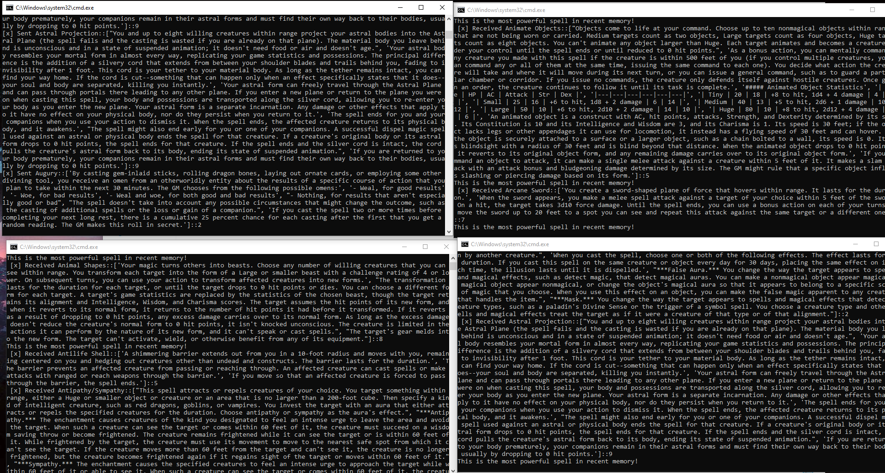

# streaming-07-custom-project
By: Gabbs Albrecht, 02/28/2023

## Intro & Operation
The modules in this repo will read information from an API and after processing and extracting what we want push the information to a RabbitMQ server where they will then be read by a consumer. The API in use provides information for the game DnD 5e. It reads spells, and then will send over their information to a queue for each class able to cast the spell.
In order to demonstrate how to properly use an event widow, I incorporated a block of code dedicated to alerting the user that if the most recent spell read is the highest level of within the past 10 spells read. This would be an event based window instead of a strictly time based, but I though the event based window made more sense due to queues getting messages asymetrically.

To operate, simply launch the producer, then launch the consumer and select your option for which queue to watch for as many of the classes as you want

## The Producer
As mentioned, this producer reads directly from an api for the spells. To accomplish this it first requests a list of spell from the api, then uses that list to request the individual information on each one to process into our message.

## The Consumer
Although there is only one consumer module in this repo, that one module will request input and allow the user to select which of the consumers they actually want to use. As previously stated, there is an alert set up to tell the user if out of the 10 most recent spells read, the current spell is the highest level one.

## Screenshots

Above we can see the producerin the top left, the druid consumer in the bottom left, the cleric consumer in the top right, and the wizard consumer in bottom left. notice the difference in which spells are being recorded, as well as our alerts.

The RabbitMQ server overview is pictured above. This gives us a great view of our processies unfolding in real time, and which queues are being consumed.

This screenshot displays the queue view of our RabbitMQ admin page, gives us another look of what consumers are active

